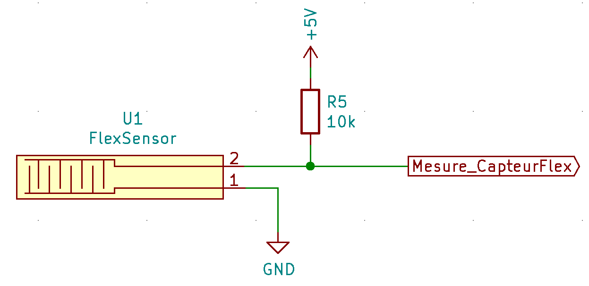

# Demo-GP4-2020-2021

- [Demo-GP4-2020-2021](#demo-gp4-2020-2021)
  - [Demo d'un nouveau projet](#demo-dun-nouveau-projet)
  - [Schématique](#schématique)
  - [PCB](#pcb)

## Demo d'un nouveau projet

- [x] Création du projet KiCad
- [x] Editer le schéma
- [x] Choisir la techno des composants
- [x] Placement
- [ ] Routage
- [ ] Génération des fichiers de conception

---

## Schématique

## PCB

Add Image...
